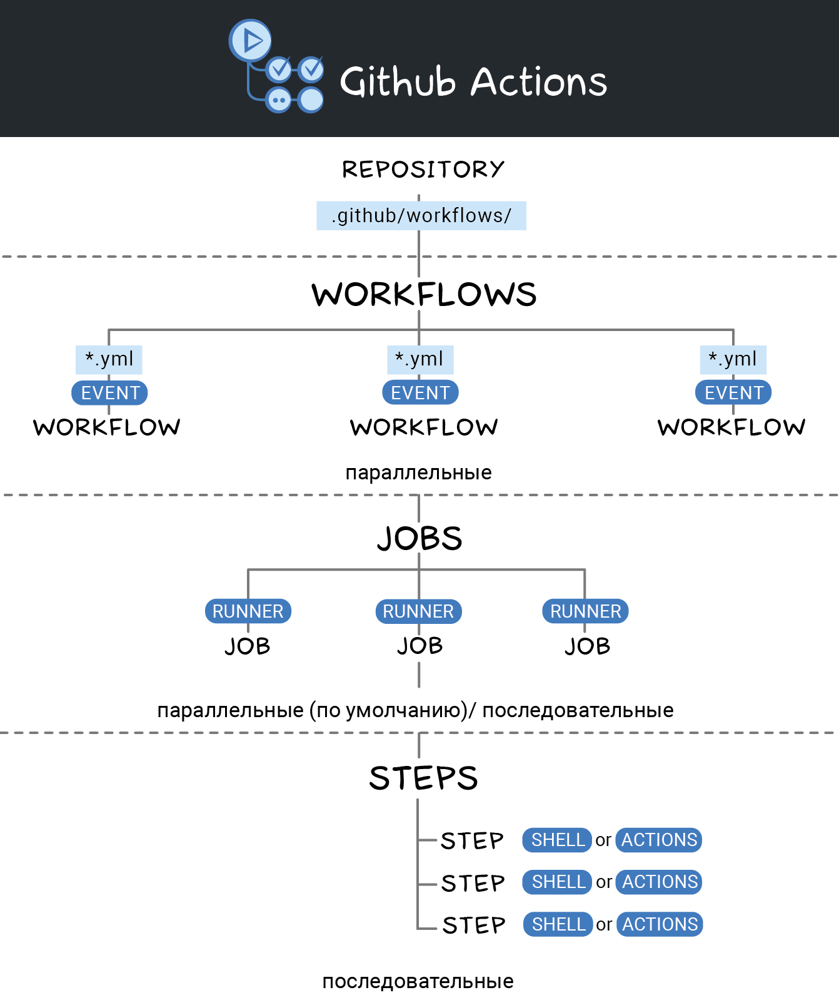

# Starting boilerplate of [Strapi](https://strapi.io/) application + CI (Github actions)

## System requirements

* NodeJS >= 18
* NPM >= 6.x
* Make

## Using

```sh
make setup
make start
```

## Run tests

```sh
make test
```

## Run linter

```sh
make lint
```

---

# Непрерывная интеграция (CI)



### Воркфлоу / Workflows

Каждый репозиторий на GitHub может содержать один или несколько воркфлоу. Каждый воркфлоу определяется в отдельном файле конфигурации в каталоге репозитория .github/workflows. Несколько воркфлоу могут выполняться параллельно.

### События / Events

Воркфлоу может запускаться одним или несколькими событиями. Это могут быть внутренние события GitHub (например, пуш, релиз или пул-реквест), запланированные события (запускаются в определенное время — например, cron) или произвольные внешние события (запускаются вызовом Webhook API GitHub).

### Задания / Jobs

Воркфлоу состоит из одного или нескольких заданий. Задание содержит набор команд, которые запускаются вместе с рабочим процессом. По умолчанию при запуске воркфлоу все его задания выполняются параллельно, однако между ними можно определить зависимость, чтобы они выполнялись последовательно.

### Раннеры / Runners

Каждое задание выполняется на определенном раннере — временном сервере на GitHub с выбранной операционной системой (Linux, macOS или Windows). Также существуют автономные раннеры, которые позволяют создать свое окружение для выполнения экшена.

### Шаги / Steps

Задания состоят из последовательности шагов. Шаг — это либо команда оболочки (shell command), либо экшен (action). Все шаги задания выполняются последовательно на раннере, связанном с заданием. По умолчанию в случае сбоя шага все следующие шаги задания пропускаются.

### Экшен / Actions

Экшен — многократно используемый блок кода, который может служить шагом задания. Каждый экшен может принимать на вход параметры и создавать любые значения, которые затем можно использовать в других экшенах. Разработчики могут создавать собственные экшены или использовать опубликованные сообществом GitHub. Общих экшенов около тысячи, все они доступны на GitHub Marketplace.

